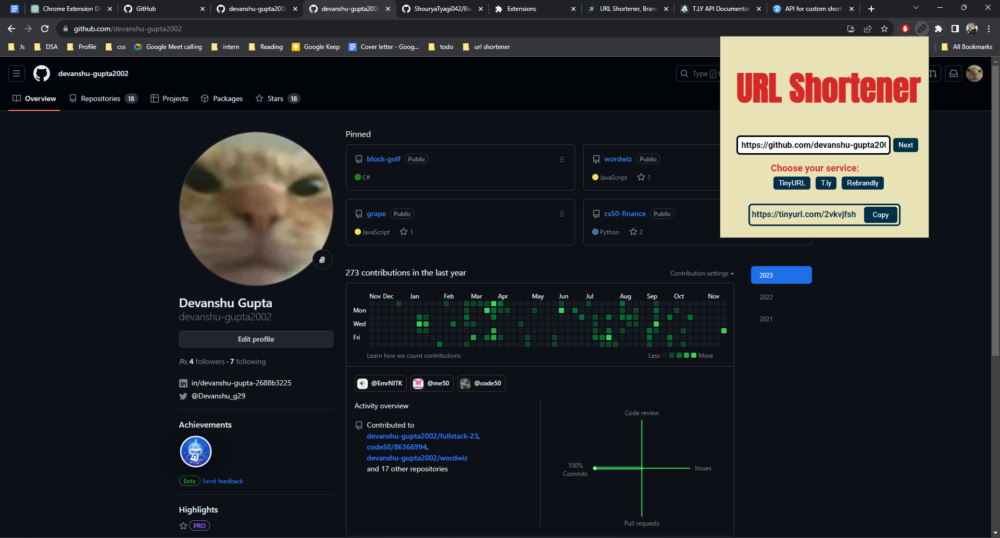

# URL Shortener Chrome Extension

## Overview

The **URL Shortener** Chrome extension is a simple tool built with React to shorten the current webpage URL using a URL shortening service. It integrates with multiple URL shortening APIs, allowing users to choose their preferred service for generating shortened links directly from their browser.

### Features

- Shorten the current webpage URL using a URL shortening service.
- Integration with multiple URL shortening service APIs:
  - [TinyURL](https://tinyurl.com/app)
  - [t.ly](https://t.ly/docs)
  - [Rebrandly](https://developers.rebrandly.com/docs)
- Popup UI for easy access and interaction.
- Error handling for invalid URLs or failed API requests.
- Notifications to inform users of the shortened URL.

## Setup

### System Without npm

If your system doesn't have npm installed, follow these steps:

1. **Clone the Repository:**
   ```bash
   git clone git@github.com:devanshu-gupta2002/url-shortener.git
   ```

2. **Enable Developer Mode in Chrome:**
   - Open the Chrome browser.
   - Go to the Extensions window by clicking on the Extensions/Puzzle Icon🧩 > Manage Extensions.

3. **Load Unpacked Extension:**
   - Enable Developer mode (toggle switch in the top right).
   - Click on "Load unpacked" and select the `build` directory from the cloned project.

### System With Node.js/npm Installed

If your system has Node.js/npm installed, it is recommended to build the project before following the steps above. Here's how:

1. **Clone the Repository:**
   ```bash
   git clone git@github.com:devanshu-gupta2002/url-shortener.git
   ```

2. **Install Dependencies:**
   ```bash
   cd url-shortener
   npm install
   ```

3. **Build the Project:**
   ```bash
   npm run build
   ```

4. **Enable Developer Mode in Chrome:**
   - Open the Chrome browser.
   - Go to the Extensions window by clicking on the Extensions/Puzzle Icon🧩 > Manage Extensions.

5. **Load Unpacked Extension:**
   - Enable Developer mode (toggle switch in the top right).
   - Click on "Load unpacked" and select the `build` directory from the cloned project.

6. **Ensure Prerequisites:**
   - Make sure you have Node.js installed (version >= 14).
   - Ensure you have npm or yarn installed.

## Folder Structure

The project follows the following folder structure:

```
url-shortener/
|-- build/             # Compiled code (generated after running npm run build)
|-- public/
|-- src/
|   |-- components/    # React components
|   |-- style/         # CSS files
|   |-- App.js
|   |-- index.js
|-- .gitignore
|-- package.json
|-- README.md
```

- **src/components:** Contains React components used in the project.
- **src/style:** Contains CSS files for styling.
- **build:** This directory is generated after running `npm run build` and contains the compiled code ready for use in the Chrome extension.

Feel free to explore the source code and customize the extension according to your needs.

## Additional Notes

- If you encounter any issues or have suggestions, please open an issue on the [GitHub repository](https://github.com/devanshu-gupta2002/url-shortener).

Happy URL shortening! 🚀

## Preview


